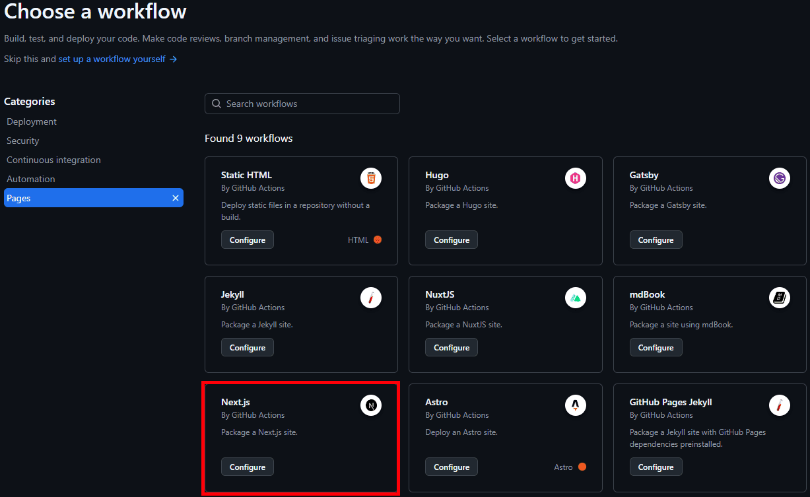

# Build

## Local

```bash
npm run build
```

# Create a Static Export
Reference: https://nextjs.org/docs/app/guides/static-exports
```
const nextConfig = {
  output: 'export',
  ...
}
 
module.exports = nextConfig
```

## GitHub Actions

Use default Next.js workflow by GitHub Actions



## GitHub Pages Configuration

Ensure Build Source is set to `GitHub Actions`.


## Deployment Environments

Reference: https://docs.github.com/en/actions/deployment/targeting-different-environments/using-environments-for-deployment


