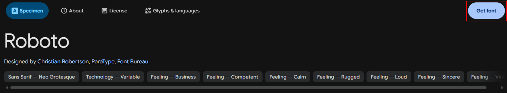
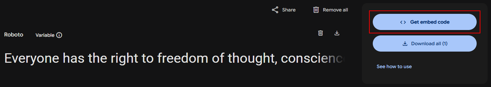
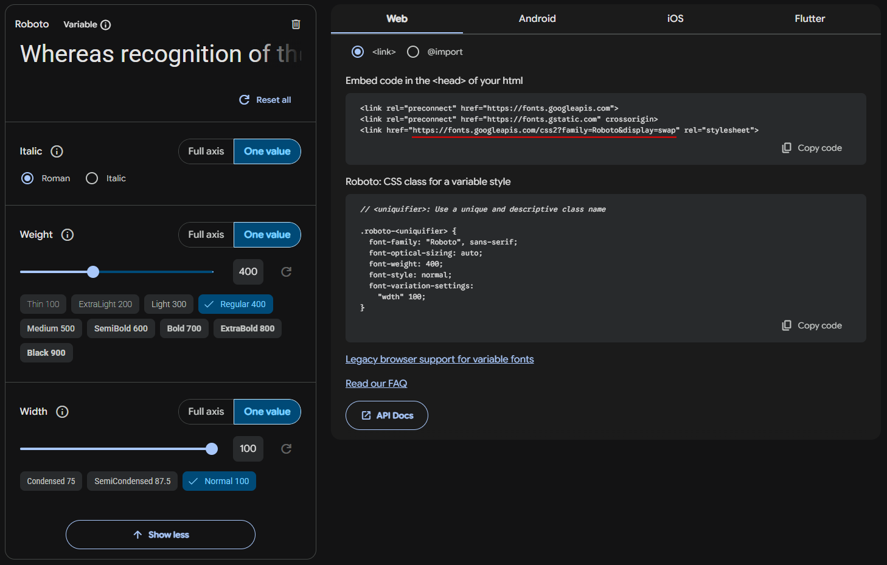

# PDF Generation

Library: https://react-pdf.org/

## Fonts
Reference: https://react-pdf.org/fonts
Need to use ttf

1. Go to https://fonts.google.com/

2. Search for your desired font


3. Get embed code


4. Adjust the font weight to your desired value. Extract the googleapis.com url from the embed code


5. For each of your desired font setting, download the ttf file
```bash
curl -X GET "https://fonts.googleapis.com/css2?family=Roboto&display=swap"
```

6. Copy the ttf url
```bash
@font-face {
  font-family: 'Roboto';
  font-style: normal;
  font-weight: 400;
  font-stretch: normal;
  font-display: swap;
  src: url(https://fonts.gstatic.com/s/roboto/v51/KFOMCnqEu92Fr1ME7kSn66aGLdTylUAMQXC89YmC2DPNWubEbWmT.ttf) format('truetype');
}
```

7. Register in the style file of react-pdf
```typescript
import { Font } from "@react-pdf/renderer";

Font.register({
  family: "Roboto", fonts: [
    { src: 'https://fonts.gstatic.com/s/roboto/v51/KFOMCnqEu92Fr1ME7kSn66aGLdTylUAMQXC89YmC2DPNWubEbWmT.ttf', fontWeight: 400 },
    { src: 'https://fonts.gstatic.com/s/roboto/v51/KFOMCnqEu92Fr1ME7kSn66aGLdTylUAMQXC89YmC2DPNWuYjammT.ttf', fontWeight: 700 },
    { src: 'https://fonts.gstatic.com/s/roboto/v51/KFOMCnqEu92Fr1ME7kSn66aGLdTylUAMQXC89YmC2DPNWuZtammT.ttf', fontWeight: 900 },
  ]
});
```
